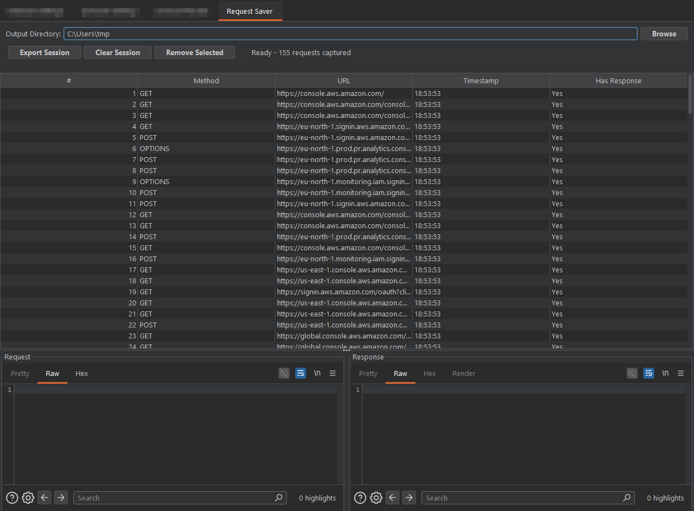

### Motivación

Al desarrollar ciertas herramientas que requieren del análisis de una secuencia de peticiones (por ejemplo, un flujo de autenticación entero con 20-25 peticiones) no veía ninguna herramienta que exportara en formato RAW (todas lo hacían en base64, formatos XML raros como el export por defecto de burp etc) las requests y responses y que se pudiera hacer en masa. 

### Usage
- Simplemente selecciona todas las peticiones y Click derecho -> extensions -> Send to exporter
- En la tab de la extensión, eliges la ruta donde se creará un directorio con las peticiones y exportas

### Build the extension
- ./gradlew jar
- <rootProjectdirectory>/build/libs/name.jar
- Cárgala en burp

#### Output
- Quizás no es la manera más eficiente pero guardo las peticiones, en orden cronológico, en formato <#orden.request> <#orden.response>
- 001.request, 001.response, 002.request...

